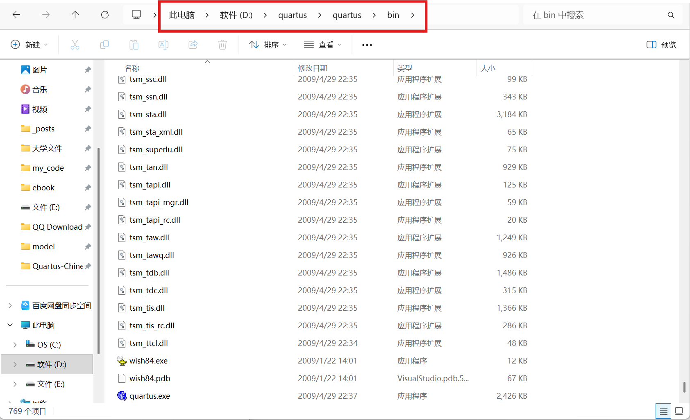

# Quartus-Chinese-trans

适用于Quartus 9.0版本的汉化补丁

## 快速开始

你无需任何依赖，你现在只需要Quartus 9.0版本。重要的事情说三遍：

**请一定核对版本号并备份！**

**请一定核对版本号并备份！**

**请一定核对版本号并备份！**

然后，你需要知道你Quartus 9.0安装的路径，然后复制一份。注意：精确到文件夹即可，不必带 `*.exe` 。就像这样：`D:\quartus\quartus\bin`

如果你是小白，请你点击红框你的内容，然后按下 `Ctrl+C`



下一步，双击 `install.bat`。或者，在项目根目录下打开终端，输入：

```powershell
.\install.bat
```

脚本会询问你的安装路径，此时将你刚才复制的内容粘贴即可

运行后，直接启动quartus即可看到汉化效果

## 原理

原理非常简单。

我们使用Resource Hacker对于可执行文件文件进行反编译，对于提取出的脚本直接进行汉化的覆盖，最后重新编译。

为了保护原软件的版权，我们不使用二进制文件。我们使用开源软件 `xdelta3` 分析修改前后的差异，生成补丁，最后再通过一键安装脚本进行安装

## 计划

由于quartus是大型软件，所以需要翻译的文本肯定分布于各个文件。我们计划逐步翻译和测试，陆续推送

## 免责声明

本项目仅用于数电课程教学及学术交流，严禁用于任何商业用途。

汉化补丁涉及对原版软件二进制文件的字节级修改，作者不保证软件功能的完整性。

使用本补丁可能导致软件崩溃、编译错误或仿真失败，请在操作前务必按照脚本提示进行备份。

因使用本补丁产生的任何损失（包括但不限于实验数据丢失、软件损坏等），作者不承担任何责任。

Quartus II 的版权归 Intel/Altera 所有，本项目仅分发差异补丁文件。

## 为什么做这个

我们的数电课程需要频繁用的quartus进行电路设计，但是全英文的UI对于大部分同学来说还是太不友好了，因此我们为爱发电，希望可以帮助到更多同学

如果这个项目帮到了你，请为我们点亮一个Star，这对我们来说真的很重要！
